# MkDocsとAzure DevOpsでCI/CD環境を整える

## はじめに

[前回](../MkDocsでドキュメントを作成する環境を整える)ドキュメントを作成するための環境を整えましたが、引き続き複数人でドキュメントを管理していく方法を考えます。  
merkdown形式でドキュメントが作成できるようになったので、ExcelやWordに比べて差分チェックが容易になりました。  
というわけでGitで管理しましょう、GitHub(クローン)を利用してGitHub Flowで運用するとレビューもやりやすくなってステキです。  
ドキュメントに対するレビュー文化を根付かせることで不可解な仕様を事前に指摘＆排除できるようにしましょう。  

また、PullRequestを経由してのmergeさせることで設計者以外が自由にドキュメントを修正することができるようになります。  
設計者に求めることはドキュメントに対しての責任を負うことで、ドキュメントを作成することではありません。  
直接的な仕様に関わらないtypoや分かりづらい表現などは誰が修正しても同じです。気付いた人がその場でパパっと修正できるような仕組みが理想です。  

## Azure DevOpsでプロジェクトを作成する

[Azure DevOps](https://azure.microsoft.com/ja-jp/services/devops/)でプロジェクトを作成してください。  
今回はCI/CDを行うことが目的なので`Version control`も`Work item process`もなんでもいいです。  

## PullRequest作成時に自動でビルドする

`PipeLines > Builds`から新しいビルドパイプラインを作成します。  

### タスクを設定する

#### Select a source

今回は[GitHub](https://github.com/Shigezo32/DocsSample)のリポジトリを利用します。  
PullRequestをトリガーとするので`Default branch for manual and scheduled builds`は初期値で構いません。  
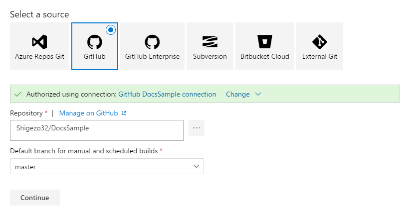

#### Select a template

MkDocs用のテンプレートがあるわけではないので空のテンプレートを選択します。  
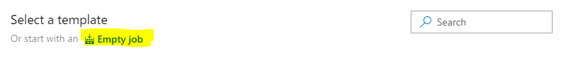

#### Pipeline

良い感じの名前を設定し、Agent poolに`Hosted VS2017`を選択します。  
　※Pythonが動作する環境であれば他のAgentでも構いません。  
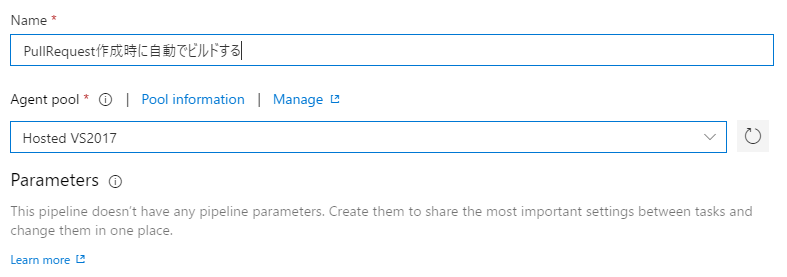

#### Get sources

`Report build status`にチェックを入れるとPullRequestにステータスが表示されるようになるのでチェックを入れましょう。  
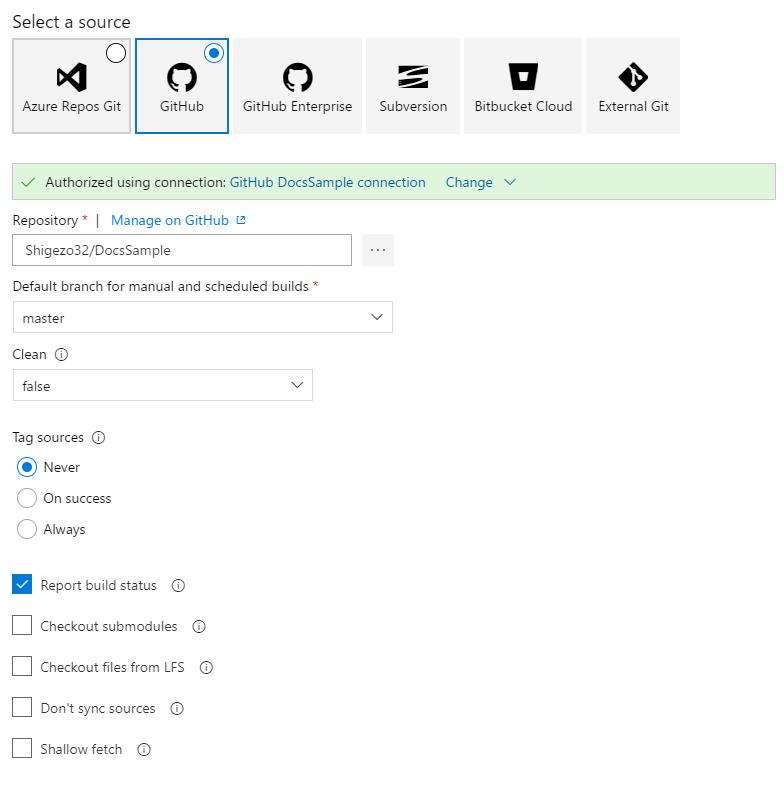

#### Agent Job

##### MkDocsでビルドする

PowerShellタスクを追加し、InlineにMkDocsをビルドするためのScriptを記載するか、ScriptファイルのPathを設定します。  
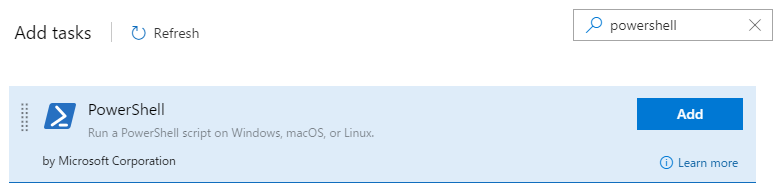
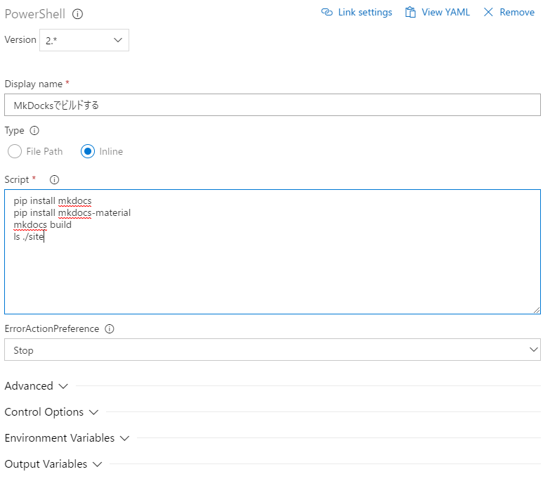

``` build.ps1
pip install mkdocs
pip install mkdocs-material
mkdocs build
ls ./site
```

##### ビルド成果物をコピーし公開する

Copy and Publish Build Artifactsタスクを追加し、site配下をすべてコピーし公開するようにします。  
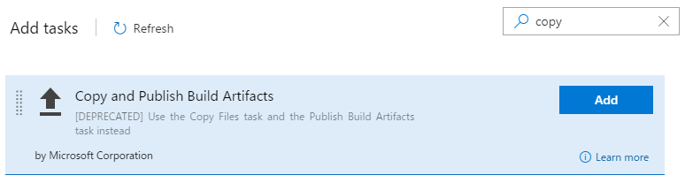
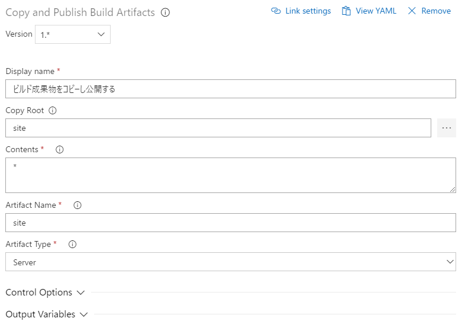

#### タスク設定完了

最終的にはこんな感じになります。  
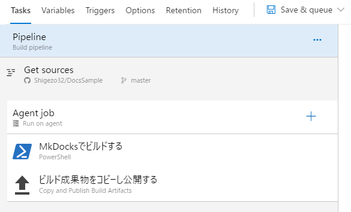

### PullRequest検証のトリガーを設定する

`Enable pull request validation`にチェックを入れ、フィルタの設定を行います。  
初期設定だとmasterに対してのPullRequestだけが対象になります。  
すべてのbranchに対して有効にしたい場合は`*`を設定しましょう。  
除外したいbranchがある場合はTypeを`Exclude`にしてbranchを選択すればいいです。  
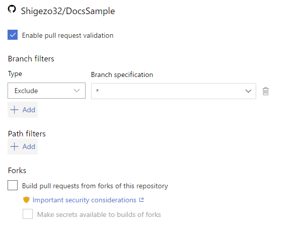

### PullRequestからの動作確認

適当に[PullRequest](https://github.com/Shigezo32/DocsSample/pull/1)を作成すると自動でビルドパイプラインが動作します。  
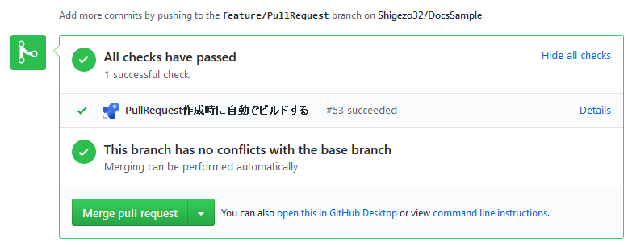

正常にビルドが終了すると`Artifacts`から成果物を取得することができます。  
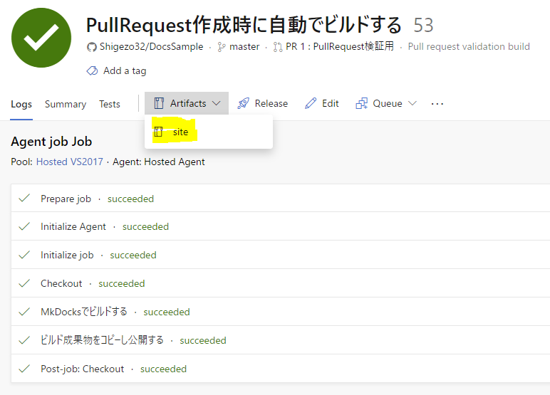

## masterへのpush時に自動でビルドしデプロイする

### ビルドパイプラインを作成する

PullRequest作成時に自動でビルドするときと同様に`PipeLines > Builds`から新しいビルドパイプラインを作成します。  
タスクの設定まで全く同じなので、Exportしてから`Import a pipeline`で作成するとちょっとだけ楽です。  

#### masterに対するCIのトリガーを設定する

`Enable continuous integration`にチェックを入れます。  
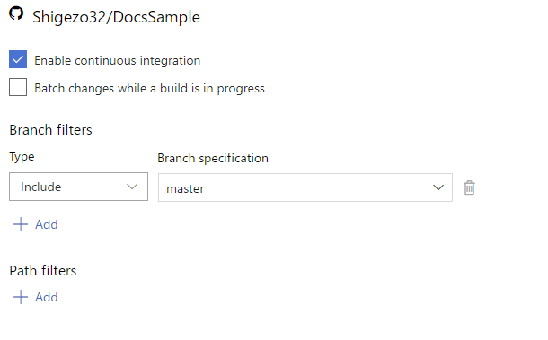

### リリースパイプラインを作成する

`PipeLines > Releases`から新しいリリースパイプラインを作成します。  

#### Select a template (releases)

今回は`Azure App Service`に対してデプロイするので、`Azure App Service deployment`のテンプレートを選択します。  
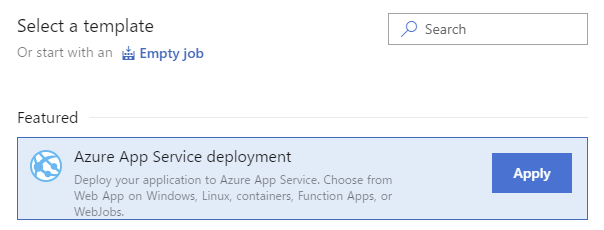

#### 成果物を選択する

`Add an artifact`からリリース対象の成果物を選択します。  
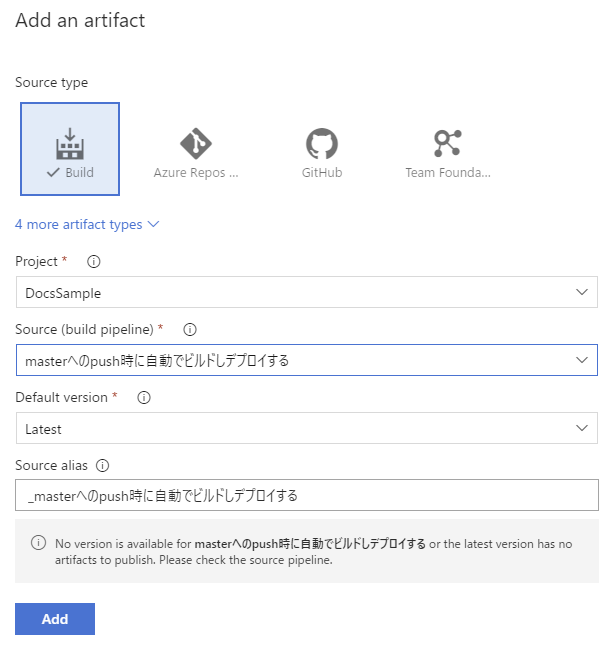

#### masterに対するCDのトリガーを設定する

稲妻アイコンからトリガーを設定します。  
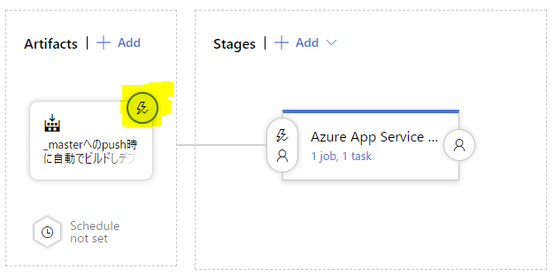
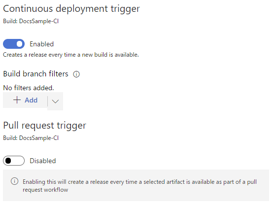

#### タスクを設定する (release)

ステージの`1 job, 1 task`をクリックしてタスクを設定します。  
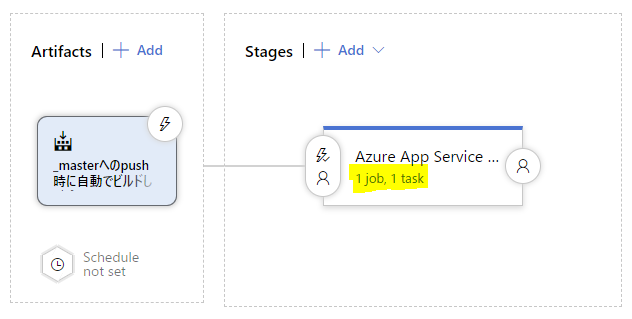

##### Stage

デプロイ先の`Azure App Service`の設定をします。  
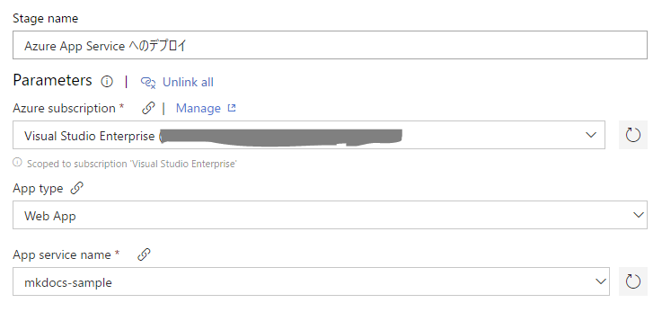

##### Deploy Azure App Service

デプロイするパッケージを設定します。  
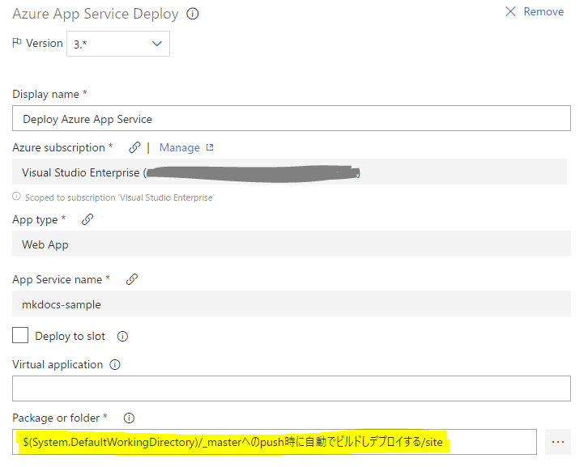

## サンプル

* [リポジトリ(GitHub)](https://github.com/Shigezo32/DocsSample)
* [デプロイ先(Azure App Service)](https://mkdocs-sample.azurewebsites.net)

## TODO

* 画像の差し替え
* markdownlintのルール設定
* textlintの利用とルール設定
* PlantUMLを利用した図の作成
* 特定のファイルが更新されたときのみ動作するパイプラインの設定