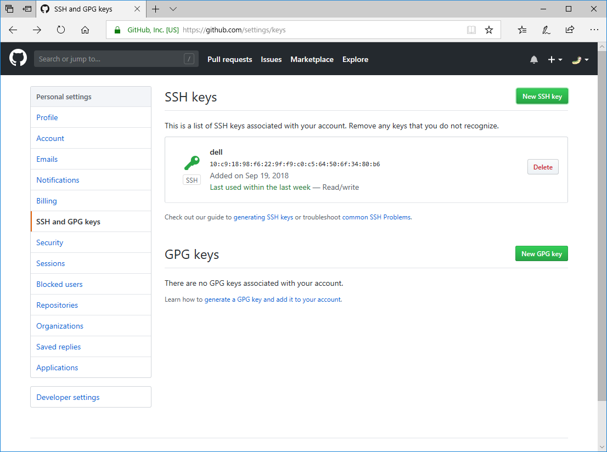
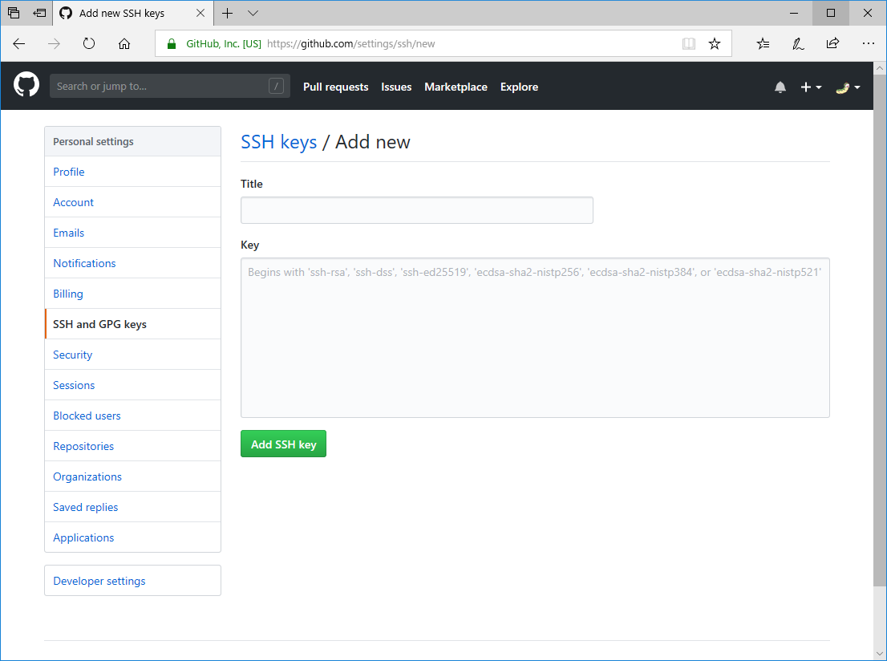
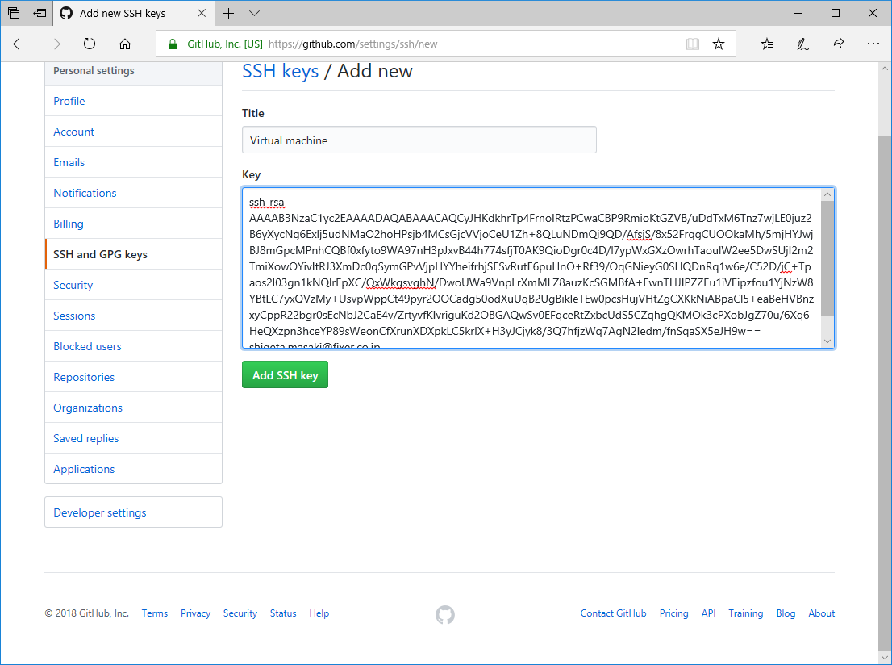
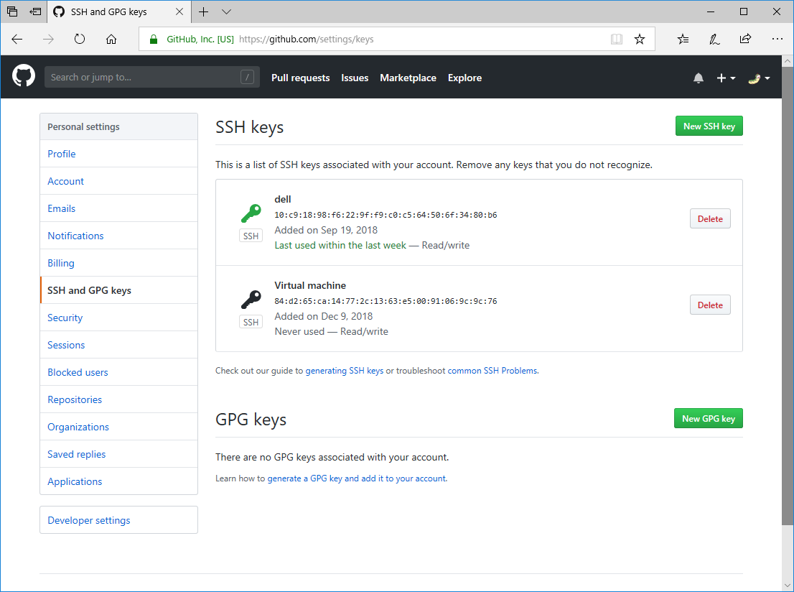
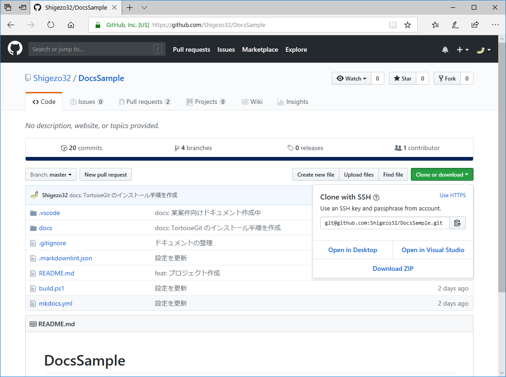
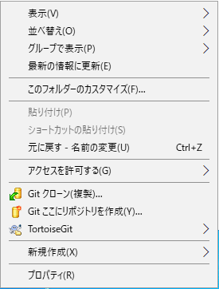
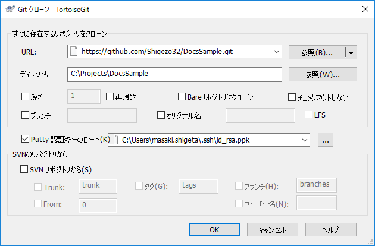
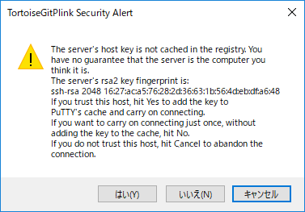
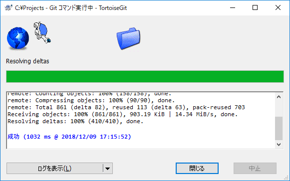
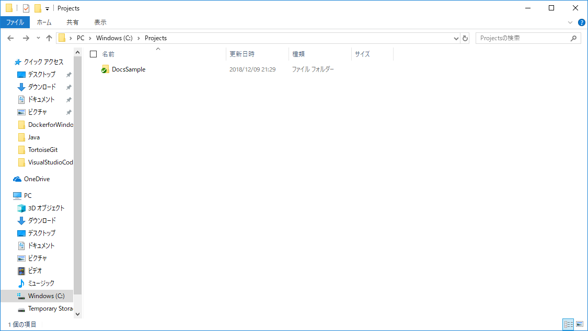

# Git 関連の操作手順

設計者向けの Git 関連の操作手順です。  

## 前提条件

* [Git for Windows](../環境構築/GitforWindowsのインストール) がインストールされていること
* [TortoiseGit](../環境構築/TortoiseGitのインストールと設定) がインストールされていること
    * [SSH key](../環境構築/TortoiseGitのインストールと設定/#SSHkeyの作成) が作成されていること

## SSH key の登録

GitHub に公開鍵を設定して SSH で接続できるようにします。  

1. GitHub の [SSH and GPG keys](https://github.com/settings/keys) から [New SSH key](https://github.com/settings/ssh/new) を開く  
    
    
2. Title と Key を設定して保存
    * Title
        * 区別できればなんでも構いませんが、PC名がいいでしょう
    * Key
        * `id_rsa.pub` の内容を貼り付けます、ssh-rsa から始まる文字列です  
            
3. SSH key が追加されたことを確認  
    

## リポジトリのクローン

GitHub からリポジトリをクローン (ローカルにコピー) します。  

1. リポジトリの URL をコピー  
    
2. エクスプローラーで `C:\Projects` を表示し、右クリックからコンテキストメニューを表示 > Git クローン(複製)... から Git クローンを選択  
    
3. Git クローン設定
    * URL
        * リポジトリの URL を指定
    * Putty 認証キーのロード (K)
        * `id_rsa.ppk` ファイルを指定  
            
4. クローンの実行
    * セキュリティの警告が表示されるので `はい(Y)` を選択  
        
    * 完了  
        
        
