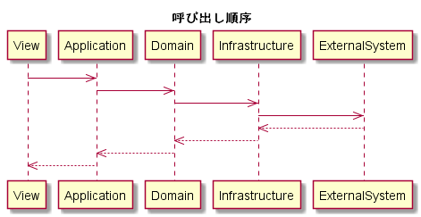

# アーキテクチャ

プロジェクトに関わるすべての人を対象にしたアーキテクチャの説明です。

## はじめに

すべてのxxxを対象とした汎用的なパッケージを開発します。  
最初のお客様としてxxx向けのカスタマイズも行う、という位置づけです。  

モノリシックなアプリケーションではなくマイクロサービス組み合わせてシステムを作ります。  
各マイクロサービスの開発はドメイン駆動設計 (DDD) で行います。  

汎用パッケージとしての機能とお客様固有の機能はレイヤー単位で責務を分けています。  
UI層とインフラストラクチャー層はカスタマイズ対象で、お客様固有の実装はこのレイヤーで行います。  
アプリケーション層とドメイン層は基本的にカスタマイズは行いません。  

## ドメイン駆動設計におけるアーキテクチャ

`レイヤードアーキテクチャ` を採用しています。  
ドメイン駆動設計におけるアーキテクチャとして、他に `ヘキサゴナルアーキテクチャ` `オニオンアーキテクチャ` `クリーンアーキテクチャ` などがありますが、これらは本質的には同じものです。  
依存関係逆転の原則によって上位のレイヤーは下位のレイヤーに依存しないように～、などと言われますが、依存性の注入 (Dependency Injection) を行えるよう抽象化するのは説明するまでもなく当たり前のことなので技術に疎い人でもわかりやい `レイヤードアーキテクチャ` としています。

## レイヤー

レイヤーは `UI層` `アプリケーション層` `ドメイン層` `インフラストラクチャー層` の4つです。
左から右へ処理が行われ、レイヤーを飛び越えることはありません。  

### UI層

クライアントアプリケーション (HTML, CSS, JavaScript) とそれを配置するためのサーバーアプリケーション (ASP.NET Core) です。  
クライアントアプリケーションは Single Page Application (SAP) で通信はアプリケーション層と行うため、UI層のサーバーアプリケーション側に処理を書くことは基本的にはありません。  

#### サーバーサイドレンダリング

以下の理由によりサーバーサイドレンダリングは行いません。  

* 実装難度/コストが高い
    * Window や LocalStorage が参照できないことを意識して設計/実装を行う必要がある
* 案件の特性上必要性が低い
    * 完全会員制のサービス
* 技術検証が行えていない
    * Angular + ASP.NET Core のテンプレートで Angular のバージョンが古く最新バージョンに対応できていない
        * JavaScriptServices に [不具合](https://github.com/aspnet/JavaScriptServices/pull/1620) があるようで修正待ち

### アプリケーション層

UI層から呼び出される Web API を定義します。  
ドメイン層に対する薄いラッパーという位置づけであり、ビジネスロジックはこのレイヤーには含めません。  
ドメイン層の呼び出しと、簡単なバリデーション (入力値チェック、相関チェック) と認証を行います。  

カスタマイズ対象ではないのでお客様固有の処理は実装しません。  

### ドメイン層

ビジネスロジックを定義します。  
インフラストラクチャー層への呼び出しを組み合わせて構築します。  

カスタマイズ対象ではないのでお客様固有の処理は実装しません。  

### インフラストラクチャー層

永続ストアとのやり取りを定義します。  
Repository パターンで実装し、呼び出し側は物理的な格納箇所 (データベース、キャッシュ、外部システム) は意識しません。  
