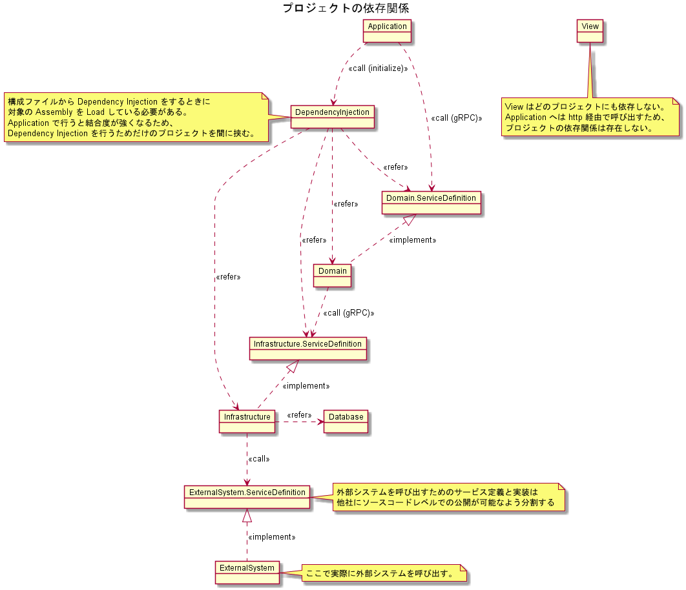

# プロジェクト

サーバー実装者向けの具体的なプロジェクトの説明です。

## 概要

### 共通

#### Resource

文字列リソースを保持するプロジェクトです。  
ユーザーや運用者に対して表示する固定文言はすべてこのプロジェクトに定義します。  
運用時に変更する可能性がある内容 (メッセージ) は定義しません。  

#### DependencyInjection

Application から他のプロジェクトへの依存関係を排除するためだけのプロジェクトです。  
Dependency Injection を行うための処理だけを定義し、それ以外の処理は定義しません。  

### UI層

#### View

クライアントアプリケーションとサーバーアプリケーションの両方が同じプロジェクトに含まれています。  
ビルド時はサーバーアプリケーションと共にクライアントアプリケーションもビルドを行い、同じパッケージとして配布できるようになっています。  

##### クライアントアプリケーション

View.ClientApp 配下がクライアントアプリケーションです。  
クライアントアプリケーションは Visual Studio Code での開発を推奨しますが、Visual Studio での開発も可能です。  

##### サーバーアプリケーション

View.ClientApp 配下以外がサーバーアプリケーションです。  
クライアントアプリケーションをホストするためだけのプロジェクトなので、基本的に処理は定義しません。  
例外としてルーティングや認証などの処理はこのプロジェクトに定義する可能性があります。  

サーバーアプリケーションは Visual Studio での開発を推奨しますが、他のテキストエディタでの開発も可能です。  
ライセンスの都合上 Visual Studio での開発が難しい場合は Visual Studio Code を推奨します。  

### アプリケーション層

#### Application

UI層 から呼び出される Web API を定義します。  
ドメイン層に対する薄いラッパーという位置づけであり、ビジネスロジックはこのレイヤーには含めません。  

##### 認証

未定。

##### ドメイン層への呼び出し

ドメイン層への呼び出しは Domain.ServiceDefinition に対して行うので、具体的な実装には依存しません。  
呼び出しのプロトコルは gRPC (MagicOnion) を想定していますが、通信回数の増加によるパフォーマンスに懸念があるため、通信を行わずプログラム的に直接呼び出すこともできるようにしています。  
構成ファイルと環境変数によって切り替えるようにしているので、通常の開発時は意識する必要はありません。  

##### バリデーション

バリデーションはまだ実現可能性の調査ができていませんが Domain Object に対して検証属性をつけることでのバリデーションを行う予定です。  
Filter で検証を行うことができるはずなので、コントローラーに検証処理を定義することはありません。  
　⇒要検証、最悪 `ModelState.IsValid` での分岐を定義するかも？  

### ドメイン層

#### Domain.ServiceDefinition

アプリケーション層から呼び出される Interface と Domain Object を定義します。  
具体的な実装は定義しません。  

#### Domain

Domain.ServiceDefinition の具体的な実装を定義します。  
カスタマイズ対象ではないのでお客様固有の処理は実装しません。  

##### インフラストラクチャー層への呼び出し

インフラストラクチャー層への呼び出しは Infrastructure.ServiceDefinition に対して行うので、具体的な実装には依存しません。  
呼び出しのプロトコルは gRPC (MagicOnion) を想定していますが、通信回数の増加によるパフォーマンスに懸念があるため、通信を行わずプログラム的に直接呼び出すこともできるようにしています。  
構成ファイルと環境変数によって切り替えるようにしているので、通常の開発時は意識する必要はありません。  

#### Domain.HttpGateway

Domain を HTTP 経由 で呼び出すためのプロジェクトです。  
Domain への呼び出しは gRPC (MagicOnion) を想定しており、手軽に呼び出すことが出来ないのでこのプロジェクトで swagger を提供します。  

#### Domain.Stub

Domain.ServiceDefinition のスタブです。  
戻り値は別のリポジトリで管理し Azure Storage へ展開するので、戻り値を生成する処理は定義しません。  

### インフラストラクチャー層

#### Infrastructure.ServiceDefinition

ドメイン層から呼び出される Interface と Domain Entity を定義します。  
具体的な実装は定義しません。  

#### Infrastructure

Infrastructure.ServiceDefinition の具体的な実装を定義します。  

##### データベースへの呼び出し

データベースへの呼び出しは単体テストが容易なのでこのプロジェクトで実装します。  
データベース自体の定義は他の機能 (バッチなど) から参照される可能性があるのでプロジェクトを分割します。  

##### キャッシュへの呼び出し

キャッシュへの呼び出しは単体テストが容易なのでこのプロジェクトで実装します。  
　⇒まだ実現可能性の調査まで出来ていませんが汎用的な実装を考えれば抽象化できるはず  

##### 外部システムへの呼び出し

外部システムへの呼び出しは単体テストが難しいことと、疎通 (結合テスト) 時に認識齟齬による不具合をできるだけ減らすため他社へソースコードの公開が可能なよう別のプロジェクトに分割し、Interface 経由で呼び出します。  

#### Infrastructure.HttpGateway

Infrastructure を HTTP 経由 で呼び出すためのプロジェクトです。  
Infrastructure への呼び出しは gRPC (MagicOnion) を想定しており、手軽に呼び出すことが出来ないのでこのプロジェクトで swagger を提供します。  

#### Infrastructure.Stub

Infrastructure.ServiceDefinition のスタブです。  
戻り値は別のリポジトリで管理し Azure Storage へ展開するので、戻り値を生成する処理は定義しません。  

#### Database

DbContext と Entity を定義します。

#### ExternalSystem.ServiceDefinition

外部システムを呼び出すための Interface と Data Transfer Object (DTO) を定義します。  
具体的な実装は定義しません。  

#### ExternalSystem

ExternalSystem.ServiceDefinition の具体的な実装を定義します。  

#### ExternalSystem.Stub

ExternalSystem.ServiceDefinition のスタブです。  
戻り値は別のリポジトリで管理し Azure Storage へ展開するので、戻り値を生成する処理は定義しません。  

## 依存関係

### オブジェクト図

各プロジェクトの具体的な依存関係を表した図です。  
最低限のプロジェクトのみを表示し、運用時に必要のないプロジェクト (テスト&デバッグ用) は表示していません。  

#### 表示していないプロジェクト

* すべてのプロジェクトから参照される
    * Resource
* テスト用
    * Domain.Stub
    * Infrastructure.Stub
    * ExternalSystem.Stub
* デバッグ用
    * Domain.HttpGateway
    * Infrastructure.HttpGateway
