# Git for Windows のイントール

設計者向けの Git for Windows のインストール手順です。  

## Git for Windows の取得

[Git for Windows](https://gitforwindows.org/) からインストーラーを取得します。  

## インストール

### ライセンスの確認

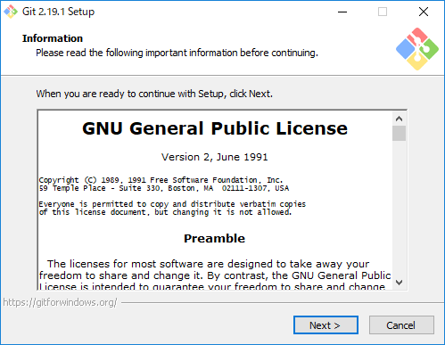

### コンポーネントの選択

すべてのチェックを外します。  

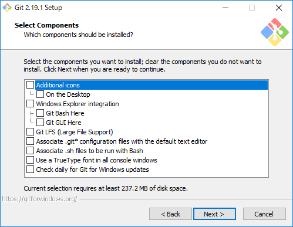

### 標準のエディターの設定

テキストエディターで設定を変更することはないので初期値で構いません。  

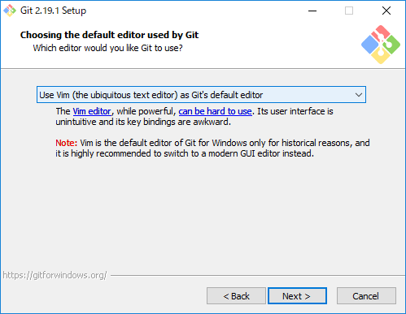

### 環境変数の設定

CUI で Git を操作することはないので `Use Git from Git Bash only` を選択します。  
開発者が コマンドプロンプト や PowerShell で Git コマンドを打ちたい場合は選択を変更するといいです。  

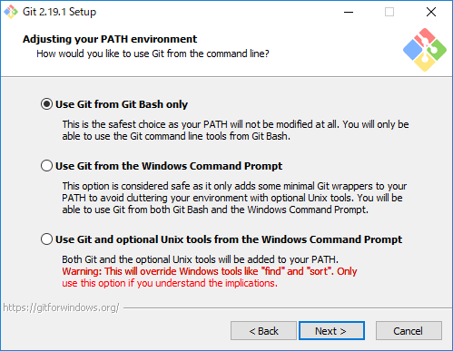

### SSLライブラリの選択

`Use the OpnSSL library` を選択します。  

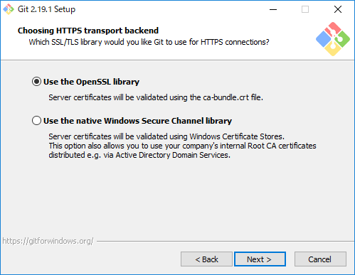

### 改行コードの扱い

`Checkout Windows-style, commit Unix-style line endings` を選択します。  

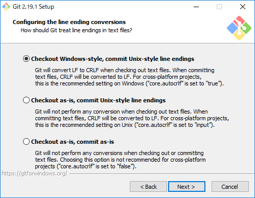

### ターミナルエミュレーターの選択

利用しないのでなんでもいいです。  

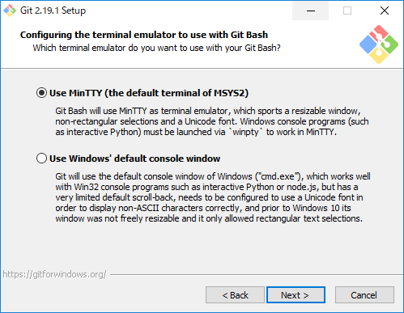

### おまけオプションの選択

3つともチェックをいれます。

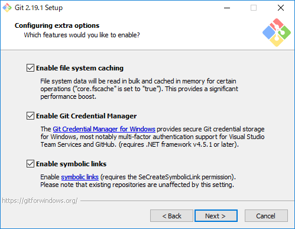

### 実験的オプションの選択

すべてのチェックをはずします。  

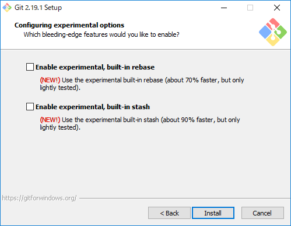

### インストール実行

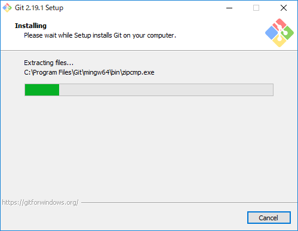

### 完了

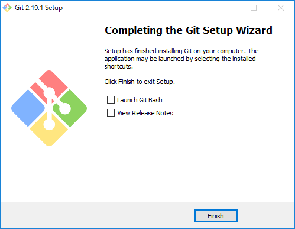

### 参考

* [私家版 Git For Windowsのインストール手順 | OPC Diary](https://opcdiary.net/?page_id=27065)
* [自分用 Git For Windowsのインストール手順 - Qiita](https://qiita.com/toshi-click/items/dcf3dd48fdc74c91b409)
* [【初心者向け】Gitのインストール方法をわかり易く解説（画面付き）](https://eng-entrance.com/git-install)
