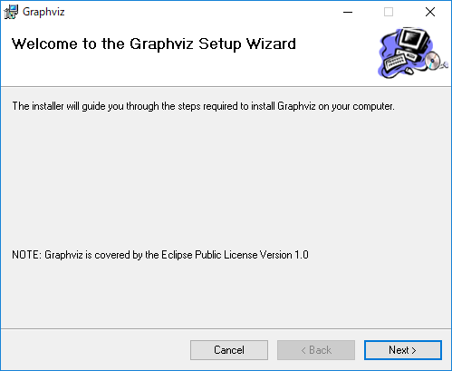
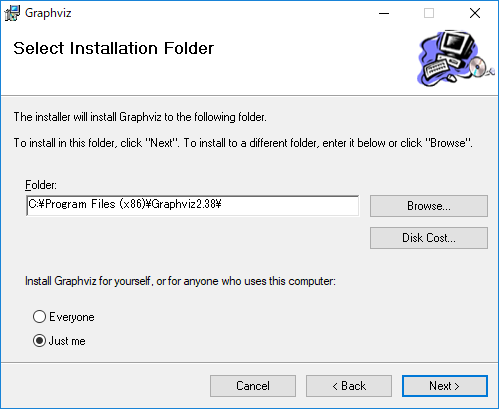
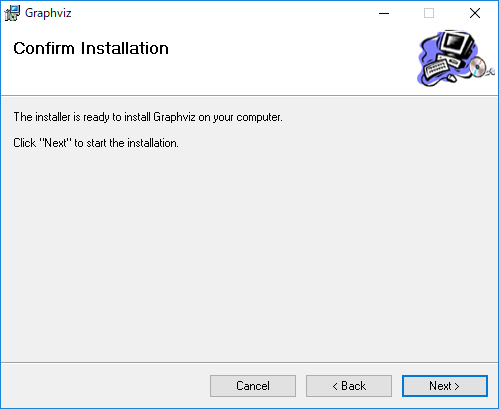

# Graphviz のイントール

設計者向けの Graphviz のインストール手順です。  

## Graphviz の取得

[Graphviz](http://www.graphviz.org/) の [Download](http://www.graphviz.org/download/) から `Stable 2.38 Windows install packages` のインストーラーを取得します。  

## インストール

特に注意することはないので何も気にせず進めれば構いません。  

