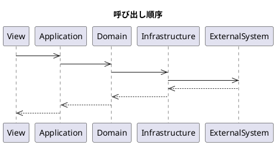

# ドキュメント

設計者向けのドキュメント作成/編集手順の説明です。  

## 前提条件

* [Docker for Windows](https://docs.docker.com/docker-for-windows/install/) がインストールされていること
* [Visual Studio Code](https://code.visualstudio.com/download) がインストールされていること
    * [markdownlint](https://marketplace.visualstudio.com/items?itemName=DavidAnson.vscode-markdownlint) 拡張機能がインストールされていること
    * [PlantUML](https://marketplace.visualstudio.com/items?itemName=jebbs.plantuml) 拡張機能がインストールされていること
    * [Debugger for Chrome](https://marketplace.visualstudio.com/items?itemName=msjsdiag.debugger-for-chrome) 拡張機能がインストールされていること
* [Java](https://www.java.com/ja/) がインストールされていること
* [Graphviz](http://www.graphviz.org/) がインストールされていること

## ドキュメントサーバーのローカル実行

ドキュメントは MkDocs というプログラムを利用して HTML への変換とサーバー実行を行っています。  
Docker と Visual Studio Code を利用する場合は細かい仕組みは何も考えずに行えるような仕組みにしています。  

1. `ドキュメント用リポジトリ` を Visual Studio Code で開く
2. ++f5++ (デバッグの開始) を実行
    * ブラウザが起動します (要 Google Chrome, Debugger for Chrome)

!!! Tip
    サーバーが起動しない場合は Docker for Windows を再起動して再度試してみましょう。  
    それでもダメならまわりの技術者にヘルプを求めてください。  

## ドキュメントの新規作成

ドキュメントは markdown 形式で記載します。  
拡張子は `.md` `.markdown` が利用できますが、このプロジェクトでは `.md` で統一します。  

1. 任意の名前 (拡張子は `.md` ) でファイルを作成
    * サーバーが実行中であればブラウザが自動でリロードし追加したファイルがメニューに表示されます

!!! Warning
    ファイル名に `&` は含めないでください。  
    ローカルサーバーでは問題なく表示されますが、共有サーバー上では表示ができません。  

!!! TODO
    markdown 記法の説明  

## シーケンス図の作成

シーケンス図 は PlantUML を利用して作成します。  

1. 任意の名前 (拡張子は `.pu` ) でファイルを作成
2. 1 で作成したファイルに以下の内容を貼り付け
3. ++alt+d++ (カーソル位置のダイアグラムをプレビュー) を実行

!!! TODO
    PlantUML 記法の説明  
