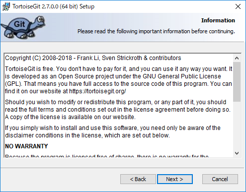
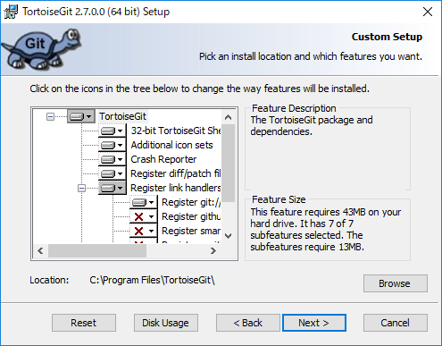
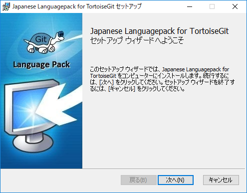
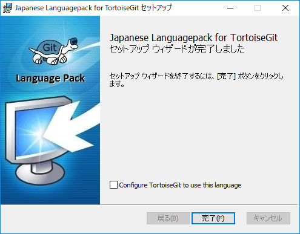
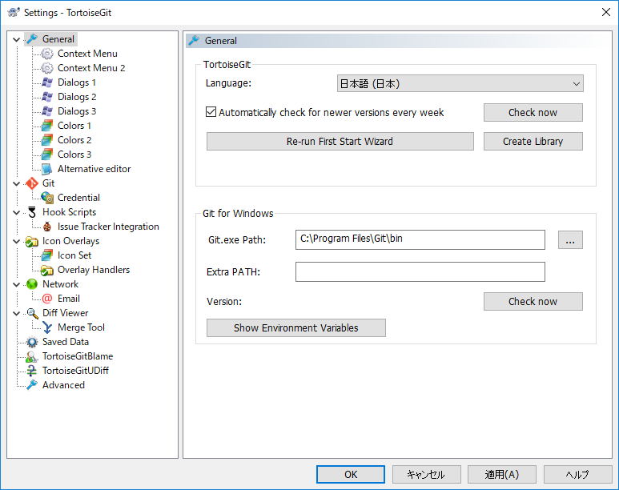
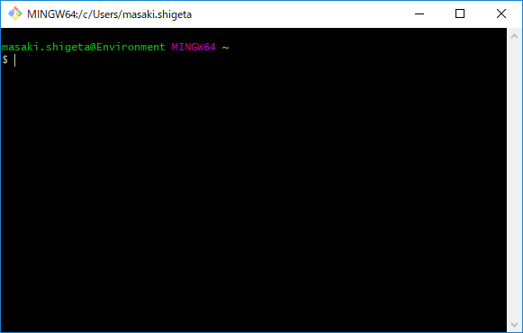
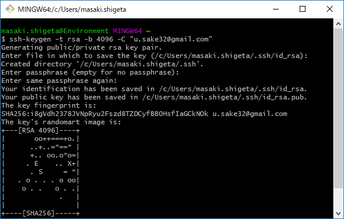
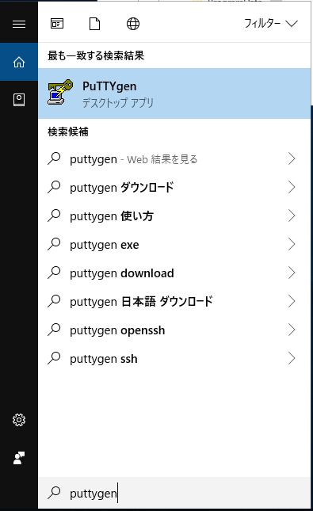
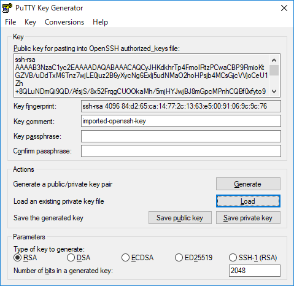
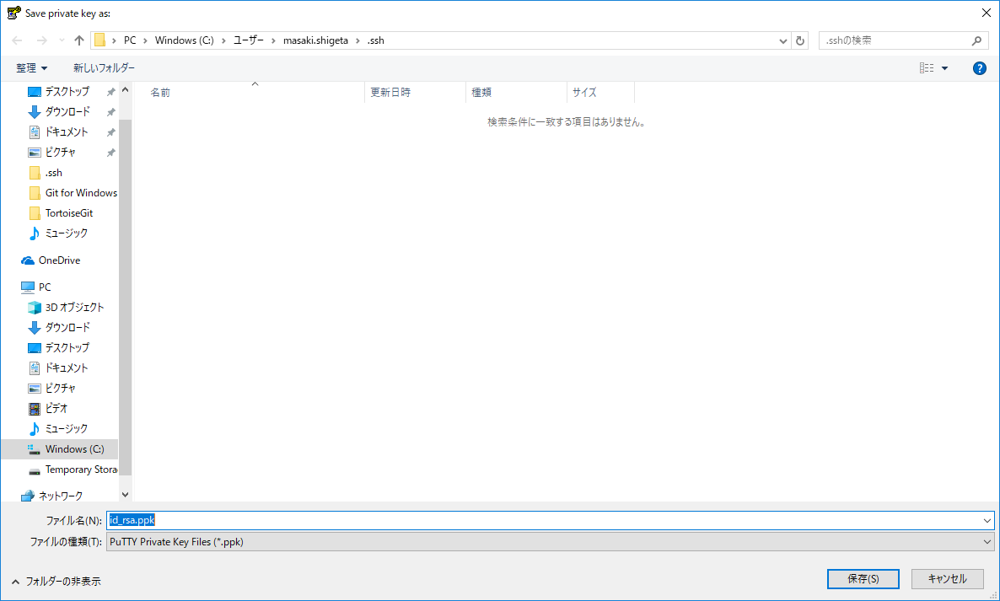

# TortoiseGit のイントールと設定

設計者向けの TortoiseGit のインストール手順です。  

## TortoiseGit の取得

[TortoiseGit](https://tortoisegit.org/) の [ダウンロード](https://tortoisegit.org/download/) から本体と日本語パックのインストーラーを取得します。  

## TortoiseGit 本体のインストール

### インストールの開始

### ライセンスの確認

### SSH クライアントの選択

`TortoiseGitPlink...` を選択します。  

### カスタムセットアップ

変更せず初期値のままで構いません。  

### インストール開始

### インストール中

### 完了

## 日本語パックのインストール

### インストール開始 { #日本語パック-インストール開始 }

### 完了 { #日本語パック-完了 }

一瞬でおわります。  

## 設定の変更

### 設定を開く

右クリックからコンテキストメニューを表示 > TortoiseGit > Settings から設定を開きます。  

### 言語の設定

General の Language で `日本語 (日本)` を選択し `OK` を押して設定を閉じます。  
　※一度設定を閉じないと言語の設定は反映されません  

### コンテキストメニュー

全般 > コンテキストメニュー で以下の項目にのみチェックをつけ他の項目のチェックを外します。  

* クローン(複製)...
* プル(P)...
* フェッチ(E)...
* コミット(C)...
* 差分(D)...
* ログを表示(L)...
* ここにリポジトリを作成(Y)...

### Git

Git でユーザー情報を設定します。  

* 名前(N)
    * コミットログに表示されるので本名を設定してください
* メール (E)
    * どこで利用されるわけでもありませんが、会社のメールアドレスを設定します

### アイコンオーバーレイ

アイコンオーバーレイ で以下のように設定します。  

* アイコンオーバーレイ
    * エクスプローラー上でのみオーバーレイとコンテキストメニューを表示(O) にチェック
* 状態のキャッシュ
    * 拡張したシェル にチェック
* 含めるパス
    * `C:\Projects` を入力

## SSH key の作成 { #SSHkeyの作成 }

### Git Bash

#### Git Bash を開く

検索に `gitbash` と入力するとすぐ見つかります。  

#### SSH Key の作成

以下の手順で SSH Key を作成します。  

1. SSH Key 作成コマンドを入力
    * `ssh-keygen -t rsa -b 4096 -C "{{メールアドレス}}"`
2. 保存場所の選択
    * 保存場所を聞かれるのでそのまま Enter キーを押してスルーします
        * `Enter file in which to save the key (/c/Users/masaki.shigeta/.ssh/id_rsa):`
3. パスフレーズの設定
    * パスフレーズを聞かれますが設定すると手間がかかるようになるので Enter キーを押してそのままスルーします
        * `Enter passphrase (empty for no passphrase):`
    * もういっちょスルー
        * `Enter same passphrase again:`

### PuTTYgen

#### PuTTYgen を開く

検索に `puttygen` と入力するとすぐ見つかります。  

#### 秘密鍵を開く

Load から秘密鍵を開きます。  
秘密鍵は Windows (C:) > ユーザー > {{ユーザー名}} > .ssh フォルダの `id_rsa` ファイルです。  
ファイルの種類を `All Files (*.*)` にしないと表示されないので気を付けてください。  
選択すると PuTTY で利用するためには～ 的なダイアログが表示されますが無視していいです。  

#### 秘密鍵を PuTTY 形式で保存

Save private key から PuTTY 形式で秘密鍵を保存します。  
パスフレーズが設定されてないけど～ 的なダイアログが表示されますが無視していいです。  
ファイル名を `id_rsa.ppk` にして保存します。

