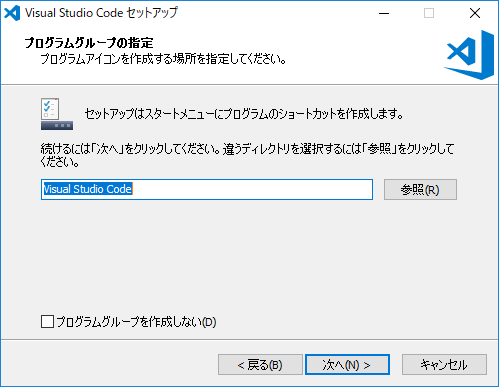
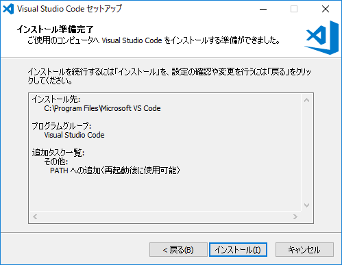
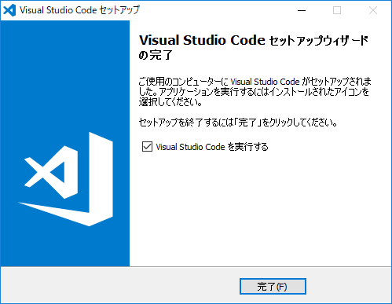
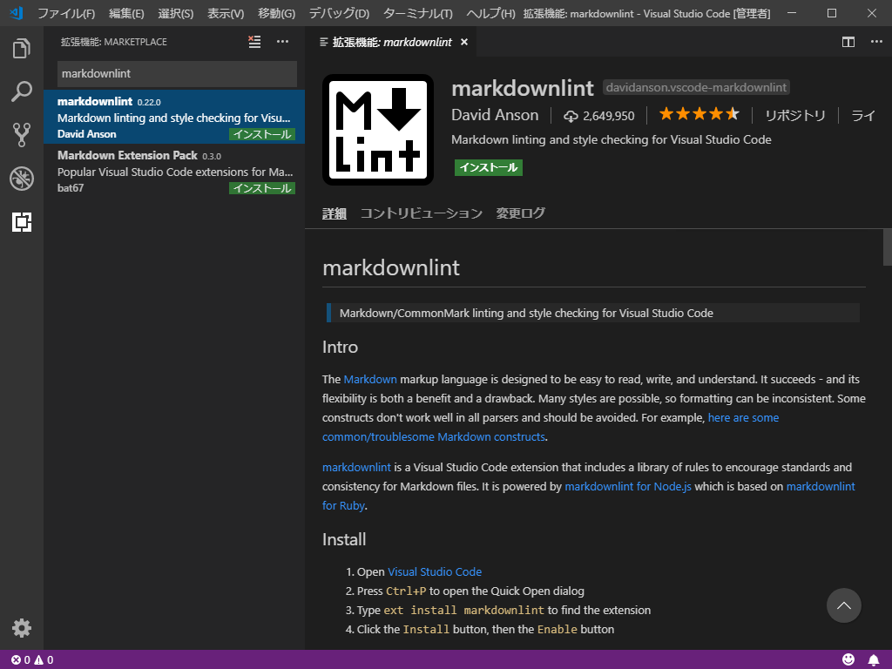

# Visual Studio Code のイントール

設計者向けの Visual Studio Code のインストール手順です。  

## Visual Studio Code の取得

[Visual Studio Code](https://code.visualstudio.com/download) からインストーラーを取得します。  

## インストール

特に注意することはないので何も気にせず進めれば構いません。  

## 拡張機能のインストール

### [Japanese Language Pack for Visual Studio Code](https://marketplace.visualstudio.com/items?itemName=MS-CEINTL.vscode-language-pack-ja)

インストール後に再起動すると日本語表示になります。  

### [markdownlint](https://marketplace.visualstudio.com/items?itemName=DavidAnson.vscode-markdownlint) { #markdownlint }

### [PlantUML](https://marketplace.visualstudio.com/items?itemName=jebbs.plantuml) { #PlantUML }

### [Docker](https://marketplace.visualstudio.com/items?itemName=PeterJausovec.vscode-docker) { #Docker }

### [Debugger for Chrome](https://marketplace.visualstudio.com/items?itemName=msjsdiag.debugger-for-chrome) { #DebuggerforChrome }

